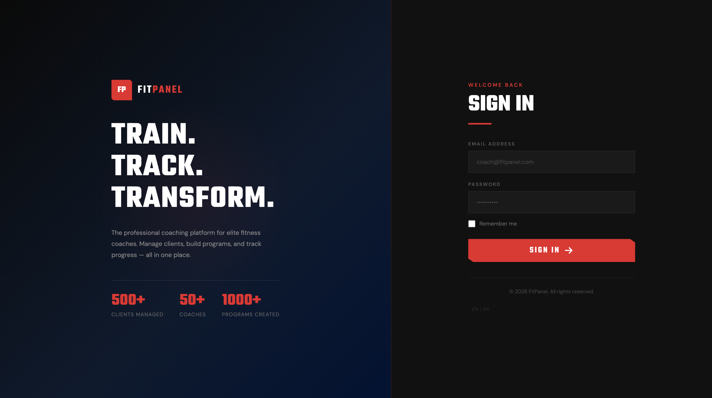
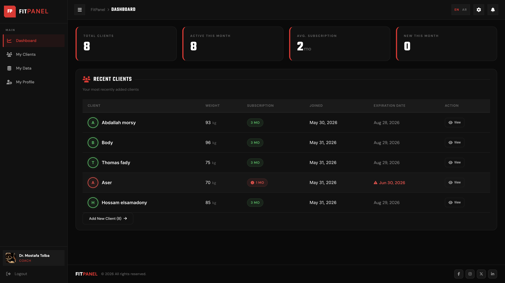
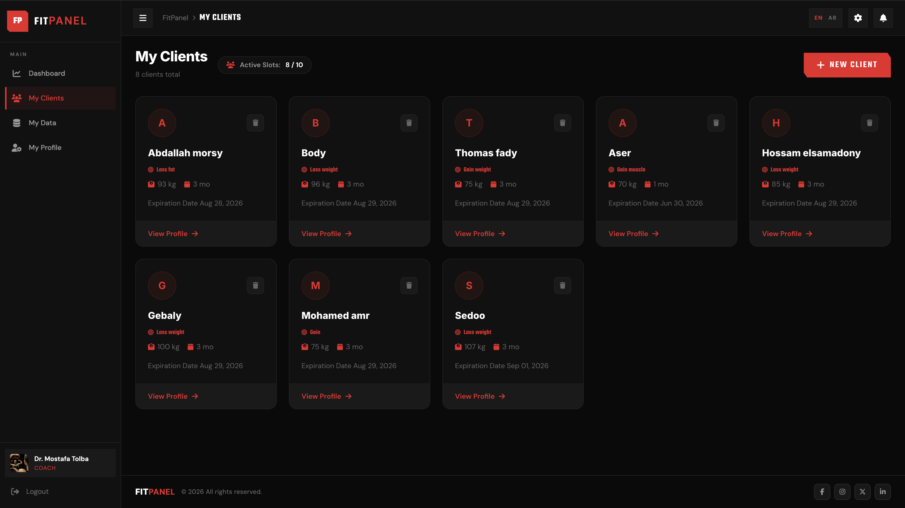
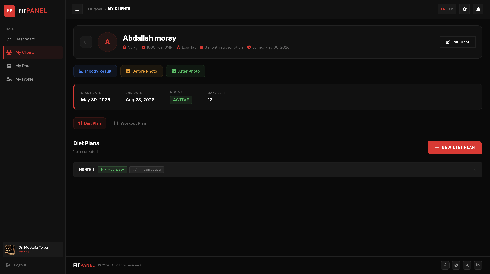
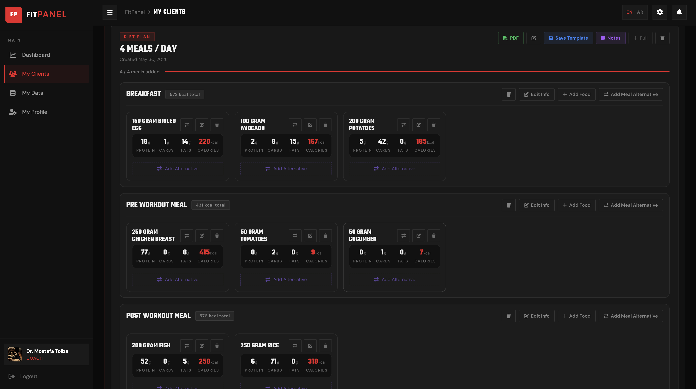
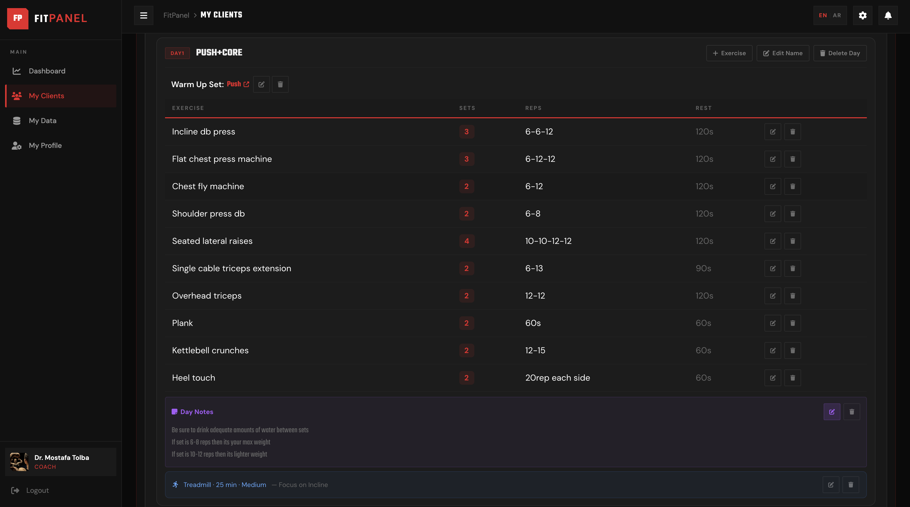
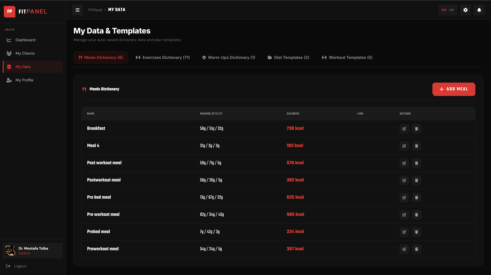
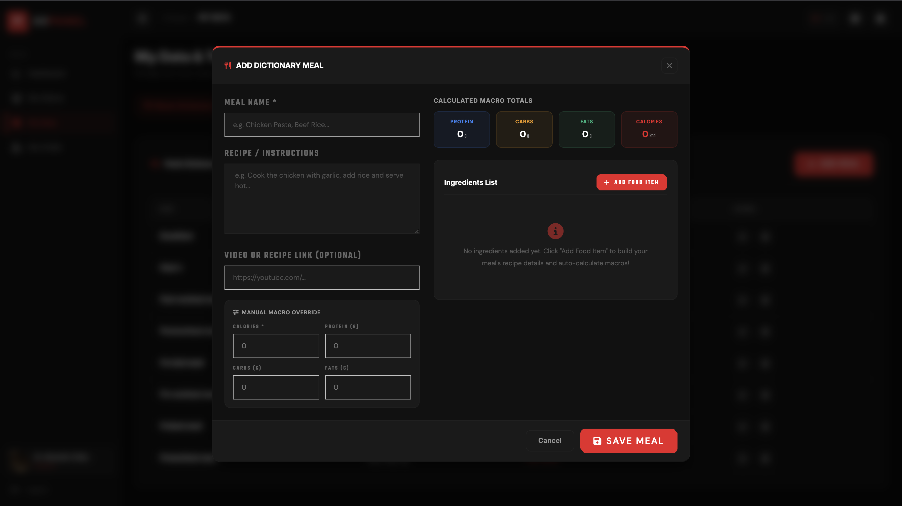
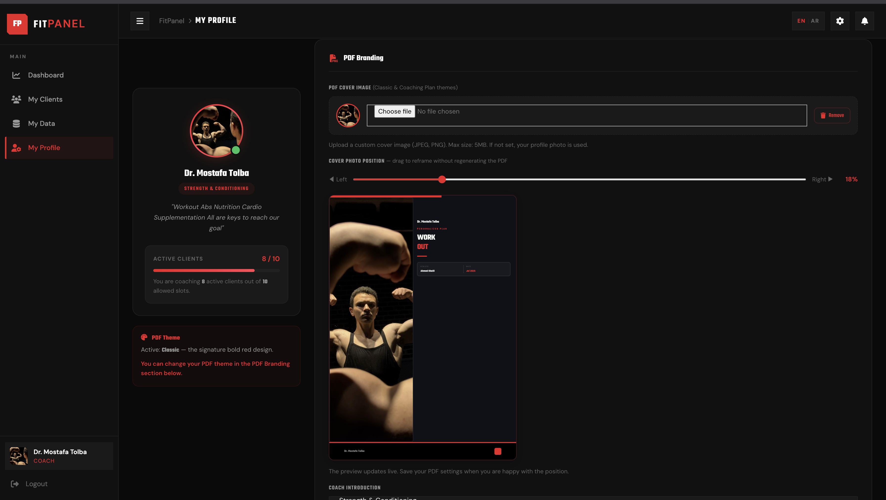
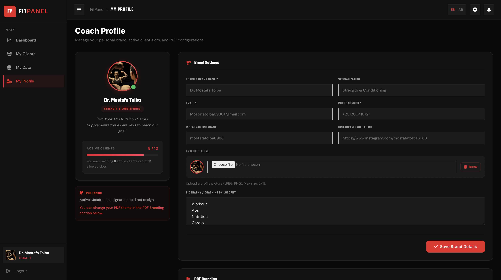

<div align="center">

# FitPanel

### *The All-in-One Command Center for Fitness Coaches*

**Stop juggling spreadsheets. Stop drowning in WhatsApp messages. Start coaching.**

[](https://dotnet.microsoft.com/)
[](https://dotnet.microsoft.com/en-us/apps/aspnet/web-apps/blazor)
[](https://www.microsoft.com/en-us/sql-server)
[](https://docs.microsoft.com/en-us/ef/core/)

</div>

---

## The Story

Every fitness coach knows the feeling — a growing client base, stacks of custom diet plans, dozens of personalized workout programs, and the never-ending task of keeping it all organized. Client A needs a high-protein plan, Client B has a knee injury, Client C's subscription just expired. Managing this manually is a full-time job on its own.

**FitPanel was built to change that.**

From a single, elegant dashboard, coaches can manage their entire practice: build fully customized diet and workout programs, auto-generate professional branded PDF documents for clients, track body metrics over time, and keep every client's journey neatly organized — all without leaving the browser.

This isn't just another fitness app. It's a **professional coaching management system** designed to give coaches back what they do best: *coaching*.

---

## Feature Highlights

### Multi-Role Authentication & Security
- Dedicated **Admin** and **Coach** roles with strict policy-based authorization
- Account lockout after 5 failed attempts (15-minute cooldown)
- Real-time security stamp validation — deactivated coaches are logged out *instantly*
- Secure cookie-based sessions with 8-hour sliding expiration
- HttpOnly + SameSite Strict cookie policies for CSRF protection

### Full Client Lifecycle Management
- Add clients with rich profiles: goals, phone number, body weight, BMR, and subscription duration
- Attach before/after progress photo links and InBody scan reports
- Track subscription start and end dates with automated status tracking (Active / Expired)
- Set per-client notes and goals to keep coaching context front and center

### Advanced Diet Planning Engine
- Build structured diet plans with any number of custom **meals** (Breakfast, Lunch, Dinner, Snacks...)
- Each meal item includes full macronutrient data: **Protein, Carbs, Fats, Calories, Quantity & Unit**
- Support for **alternative meal items** — give clients swap options for flexible dieting
- Support for **alternative whole meals** — swap an entire meal block with a different option
- Add video or recipe links directly to individual meals for client guidance
- Per-meal instructions for preparation notes and timing
- **Automatic calorie & macro totals** calculated per plan

### Structured Workout Builder
- Create named workout splits (e.g., "PPL Split", "Upper/Lower", "Full Body")
- Build workout days with day-of-week assignment (Monday through Sunday)
- Each day supports: a **warm-up** (name + video link), a full exercise table, an optional **cardio session**, and per-day coaching notes
- Exercise entries include: Sets, Reps, Rest Time, and exercise name pulled from your personal dictionary
- Cardio sessions include: Type, Duration, and Intensity (Low / Medium / High)

### Personal Coach Dictionaries
- Build a reusable library of **Meals**, **Exercises**, and **Warm-Ups** unique to each coach
- Quickly populate plans by picking from your own dictionary — no retyping the same items repeatedly
- Keeps your coaching vocabulary consistent and professional across all clients

### Plan Templates (Save & Reuse)
- Save any Diet Plan or Workout Program as a **named template**
- Apply a template to a new client in one click and customize from there
- Templates are stored per-coach — your intellectual property stays yours

### Real-Time Nutrition Lookup
- Integrated with the **CalorieNinjas API** for instant nutritional data lookups
- Search any food item by name and auto-populate macro values directly into a meal item
- Removes guesswork and speeds up diet plan creation dramatically

### Professional Branded PDF Export
- Generate polished, print-ready PDF documents for both **Diet Plans** and **Workout Programs**
- Each PDF includes the coach's **branding**: name, logo/cover image, Instagram handle, bio, and certifications
- Multiple **PDF themes** available (Admin-controlled theme unlock per coach)
- Customizable cover image position and introduction text
- PDFs are formatted cleanly for client delivery — no extra design work needed

### Notification System
- Coaches receive in-app notifications for important events (e.g., subscription expiry reminders)
- Notifications are tracked with read/unread state and timestamps

### Localization Support (Arabic & English)
- Full RTL-ready bilingual support for **English** and **Arabic**
- Language preference is persisted via cookie across sessions
- Culture switcher available from within the application

### Admin Control Panel
- Platform-wide oversight of all registered coaches
- Activate or deactivate coach accounts in real time
- Control PDF theme access on a per-coach basis
- Set client caps (max number of clients per coach)
- Manage coach subscription periods

---

## Technology Stack

| Layer | Technology |
|---|---|
| **Framework** | ASP.NET Core 9.0 |
| **UI** | Blazor Server (Interactive Server Render Mode) |
| **Database** | Microsoft SQL Server |
| **ORM** | Entity Framework Core |
| **Authentication** | ASP.NET Core Identity |
| **API Layer** | ASP.NET Core Minimal APIs |
| **PDF Generation** | Custom PdfService (server-side rendering) |
| **Nutrition Data** | CalorieNinjas REST API |
| **Localization** | ASP.NET Core Request Localization |

---

## Database Architecture

FitPanel uses a normalized relational schema managed through Entity Framework Core Code-First migrations.

```
PanelUser (IdentityUser)
├── Clients (1:N)
│   ├── Diets (1:N)
│   │   └── DietMeals (1:N)
│   │       ├── MealItems (1:N)
│   │       │   └── AlternativeItems (1:N)
│   │       └── AlternativeMeals (self-referencing 1:N)
│   └── WorkOuts (1:N)
│       └── WorkOutDays (1:N)
│           ├── Exercises (1:N)
│           └── Cardio (1:1, optional)
├── CoachMealDictionary (1:N)
├── CoachExerciseDictionary (1:N)
├── CoachWarmUpDictionary (1:N)
├── DietTemplates (1:N)
├── WorkoutTemplates (1:N)
└── Notifications (1:N)
```

---

## Getting Started

### Prerequisites

- [.NET 9.0 SDK](https://dotnet.microsoft.com/en-us/download)
- Microsoft SQL Server (local or remote)
- Git

### 1. Clone the Repository

```bash
git clone <repository_url>
cd FitPanel
```

### 2. Configure the Connection String

Open `FitPanel/appsettings.json` and update the connection string:

```json
"ConnectionStrings": {
  "cs": "Server=YOUR_SERVER_NAME;Database=FitPanelDb;Trusted_Connection=True;MultipleActiveResultSets=true;Encrypt=False"
}
```

### 3. (Optional) Configure Nutrition API

To enable the real-time nutrition lookup feature, add your [CalorieNinjas](https://calorieninjas.com/) API key:

```json
"CalorieNinjas": {
  "ApiKey": "YOUR_API_KEY_HERE"
}
```

### 4. Apply Database Migrations

```bash
cd FitPanel
dotnet ef database update
```

### 5. Run the Application

```bash
dotnet run
```

Navigate to `https://localhost:5001` (or the port shown in the terminal).

### 6. Default Credentials

The database seeds two default accounts on first run:

| Role | Email | Password |
|---|---|---|
| **Admin** | admin@fitpanel.com | Admin@123456 |
| **Coach** | coach@fitpanel.com | Coach@123456 |

> **Note:** Change these credentials immediately in any non-development environment.

---

## Screenshots

### Login


### Coach Dashboard


### My Clients


### Client Details


### Diet Plan Builder


### Workout Plan Builder


### Coach Dictionary


### Add Meal to Dictionary


### PDF Branding Settings


### Coach Profile


---

## LinkedIn Description

Just shipped FitPanel — a full-stack coaching management platform I built from scratch using Blazor Server, ASP.NET Core 9, and Entity Framework Core.

Managing dozens of clients, building personalized diet and workout plans, and delivering professional PDF documents used to be a manual nightmare for fitness coaches. FitPanel eliminates that friction entirely.

**What I built:**
- A complete workout builder with day-by-day split programming, warm-ups, cardio sessions, and exercise libraries
- A nutrition planning engine with macro tracking, alternative meal swaps, and real-time calorie lookup via the CalorieNinjas API
- A server-side PDF generation system with full coach branding support (logo, bio, Instagram, certifications, themes)
- Reusable plan templates to help coaches work faster
- Role-based multi-tenancy (Admins + Coaches) with ASP.NET Core Identity, real-time account deactivation, and account lockout security
- Bilingual (English/Arabic) with RTL support and culture-persisted preferences

Every coach gets their own workspace, client base, personal dictionaries, and branded exports. It's the tool I wish existed.

**Tech Stack:** C# · ASP.NET Core 9 · Blazor Server · Entity Framework Core · SQL Server · Minimal APIs · CalorieNinjas API

#dotnet #blazor #aspnetcore #csharp #fitness #saas #buildinpublic #webdevelopment #entityframeworkcore

---

<div align="center">

Built for fitness professionals who deserve better tools.

</div>
