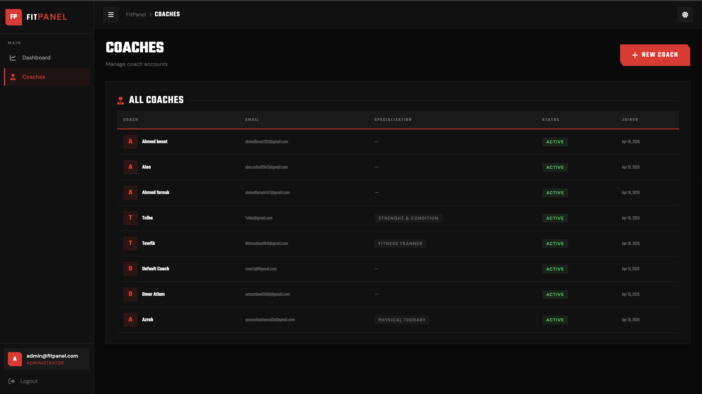
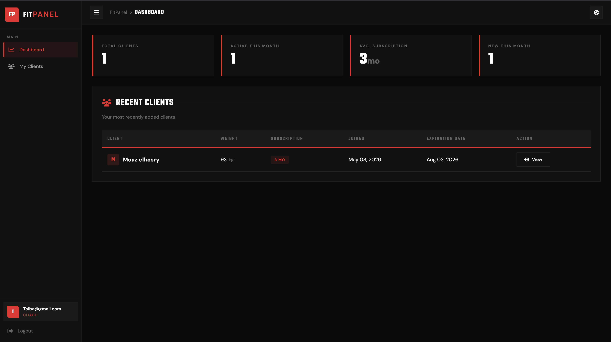
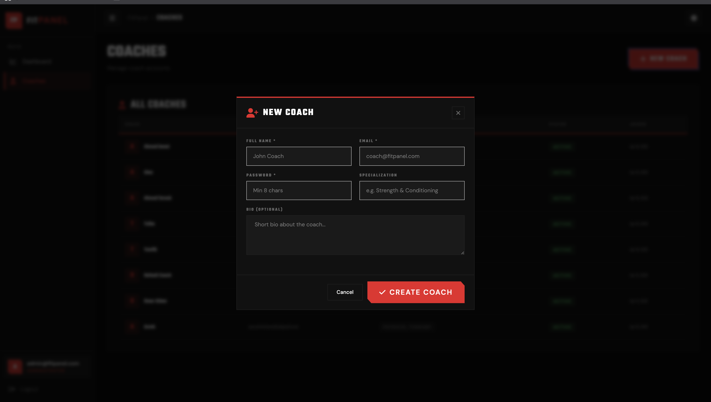
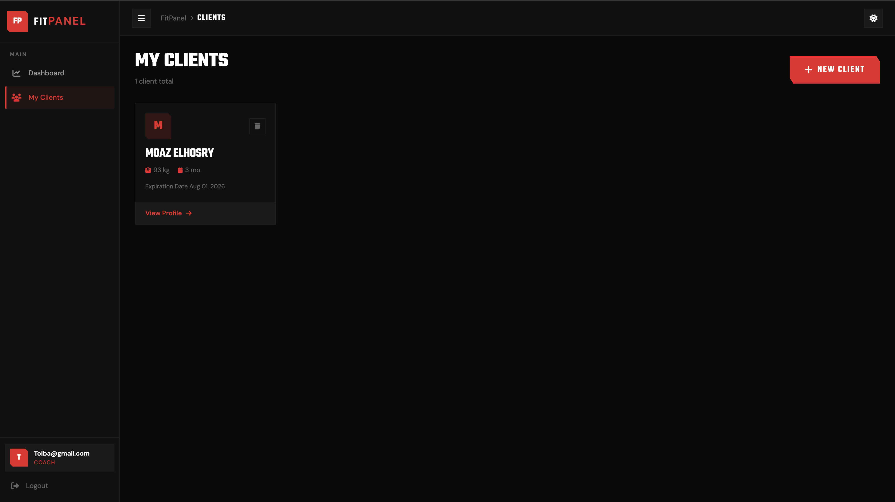
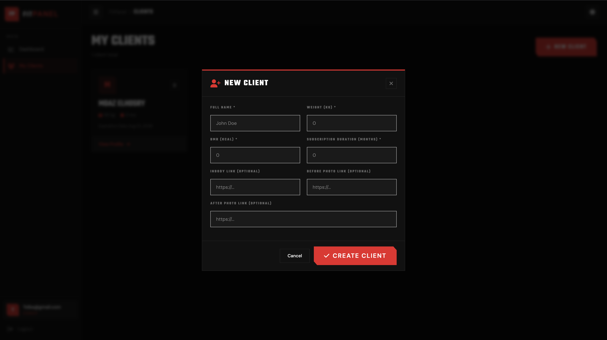
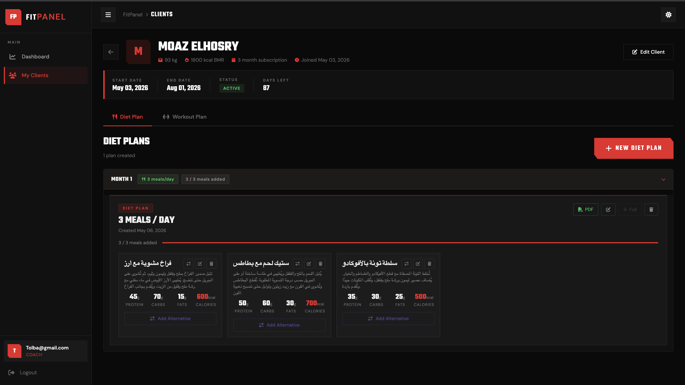
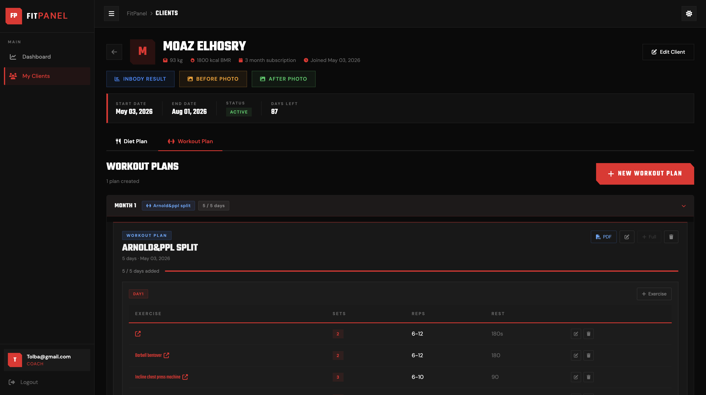

# FitPanel

FitPanel is a comprehensive management system built for fitness professionals and system administrators. It streamlines the day-to-day operations of fitness coaches by allowing them to manage their clients, design custom diet plans, build structured workout routines, and track overall progress in one unified platform. 

## Core Features

*   **Role-Based Access Control:** Secure authentication and authorization powered by ASP.NET Core Identity, featuring dedicated roles for Administrators and Coaches.
*   **Client Management:** Coaches can seamlessly add, edit, and monitor their clients, including tracking body metrics (weight, BMR), subscription durations, and progress photos.
*   **Diet and Nutrition Planning:** Advanced tools to create detailed diet plans, configure meal items, and manage alternative nutritional options for clients.
*   **Workout and Cardio Routines:** Comprehensive workout builders that allow coaches to define workout days, specific exercises, and cardio sessions.
*   **PDF Generation:** Automatically export personalized diet and workout plans into professional PDF documents.
*   **Admin Controls:** Administrators have a high-level overview to manage coaches across the platform.

## Technology Stack

*   **Backend:** C#, ASP.NET Core, Minimal APIs.
*   **Frontend:** Blazor Server (Razor Components) and HTML/CSS.
*   **Database:** Microsoft SQL Server, Entity Framework Core.
*   **Authentication:** ASP.NET Core Identity with cookie-based sessions.

## Database Architecture and Relations

FitPanel utilizes a relational database architecture managed through Entity Framework Core. The core relationships include:

*   **PanelUser (IdentityUser):** Serves as the primary user entity (Admin or Coach). It stores profile details such as specialization and bio.
*   **Coach to Clients (1:N):** A single Coach (PanelUser) can manage multiple Clients. The database enforces a restrict-delete behavior to ensure client records are not orphaned.
*   **Client to Diets (1:N):** Each Client can have multiple assigned Diet plans tailored to their goals.
*   **Client to Workouts (1:N):** Each Client can have multiple assigned Workout routines.
*   **Diet Components:** Diets are composed of related MealItems and AlternativeItems.
*   **Workout Components:** Workouts are structured into WorkOutDays, which contain specific Exercises and Cardio activities.

## Getting Started

### Prerequisites

*   .NET 8.0 or .NET 9.0 SDK
*   Microsoft SQL Server
*   Git

### Clone the Repository

Open your terminal and clone the repository using:

```bash
git clone <repository_url>
cd FitPanel
```

### Configuration

Update the database connection string. Open `FitPanel/appsettings.json` or `FitPanel/appsettings.Development.json` and ensure the connection string named `cs` points to your SQL Server instance:

```json
"ConnectionStrings": {
  "cs": "Server=YOUR_SERVER_NAME;Database=FitPanelDb;Trusted_Connection=True;MultipleActiveResultSets=true;Encrypt=False"
}
```

### Database Setup

Apply the Entity Framework Core migrations to create the database schema:

```bash
cd FitPanel
dotnet ef database update
```

### Running the Application

Start the development server:

```bash
dotnet run
```

### Default Credentials

Upon the first run, the system automatically seeds the database with the required roles and default users for testing purposes.

*   **Admin Login:** admin@fitpanel.com / Admin@123456
*   **Coach Login:** coach@fitpanel.com / Coach@123456

## Screenshots

### Admin Dashboard


### Coach Dashboard


### Add New Coach


### Client List


### Add New Client


### Diet Plan Management


### Workout Plan Management

